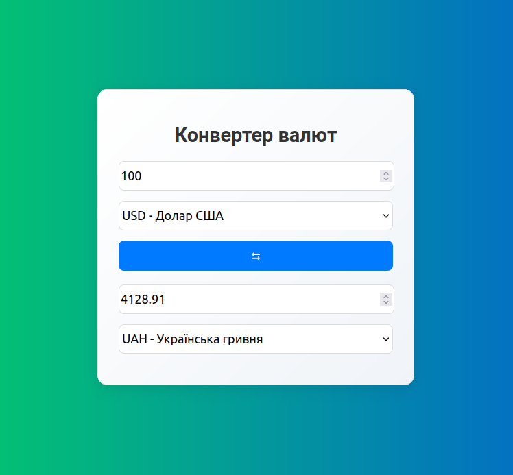

# currency-converter

### Showcase

    

### About project

The Currency Converter is a web application that allows users to convert amounts between different currencies in real-time

### How does the project work?

The Currency Converter operates by retrieving exchange rates from an external [API](https://bank.gov.ua/ua/open-data/api-dev) and utilizing TypeScript to perform calculations based on user inputs. The application provides options to select currencies, input amounts, and display converted values instantly

### Requirements to run the application

To start the project, you will need:

1. TypeScript >= **4.7.4**
2. Angular >= **18.2.0**
3. @angular/common/http >= **18.2.0**

### How to run the application?

1. Clone a repository:

   `git clone https://github.com/shavlenkov/currency-converter.git`

2. Go to the currency-converter folder:

   `cd currency-converter`

3. Install all dependencies using npm:

   `npm install --force`

4. Run the application for production:

   `npm start`

5. Open a browser and go to the address:
   [http://localhost:4200](http://localhost:4200 'http://localhost:4200')
